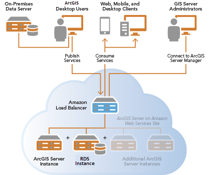

# **Amazon Web Services**

Issue: [#7](<https://github.com/Geosoft2/geosoft2-2021/issues/7>)  
Authors: [@JanSeemann92](https://github.com/JanSeemann92), [@fbruc03](https://github.com/fbruc03)

## _**Was ist AWS?**_

Amazon Web Services (AWS) ist ein Tochterunternehmen von Amazon, welches auf Cloud-Dienstleistungen spezialisiert ist. AWS stellt seinen Kunden unter anderem Rechenleistung, Speicheroptionen und Anwendungen zur Verfügung, um diesen so den Aufbau anspruchsvoller Anwendungen zu erleichtern.
Amazon Web Services gilt heute als führender Anbieter im Bereich des Cloud-Computings.

---

## **Cloud Computing**

### _**Was ist Cloud Computing?**_

Als Cloud-Computing bezeichnet man die Nutzung von IT-Infrastrukturen und Dienstleistungen über ein Netzwerk (z.B. das Internet). Hierbei werden diese Daten oder Anwendungen nicht vor Ort auf dem lokalen Rechner gespeichert, sonder an einem beliebigen anderen Ort der oft mit einer Cloud illustriert wird.
Diese sogenannten Services sind On-Demand verfügbar und jederzeit skalierbar. Für Unternehmen entfallen somit große Vorabkosten für die Beschaffung und Organisation der nötigen Infrastruktur.

---

### **Vorteile von Cloud-Computing**

- **Kapitalkosten werden durch variable Kosten ersetzt**
  - Kein eigenes Rechenzentrum oder Server nötig
- **Skalierbar**
  - Werden weniger Resourcen verbraucht fallen auch weniger Kosten an
- **Mehr Zeit für eigene Aufgaben**
  - Keine Zeit mit Bereitstellung und Wartung der eigenen Infrastruktur verschwenden
- **Ortsunabhängiger Zugriff**
  - Zugriff auf gewünschte Services ist nicht an den Arbeitsplatz gebunden
- **viele geographische Standorte**
  - 25 aktive Regionen, 81 "Availability Zones"

---

## **Cloud-Computing-Modelle**

### **Infrastructure as a Service (IaaS) - Cloud Infrastruktur**

Bereitstellung von Rechenzentrumsinfrastruktur z.B.:

- Server, Rechen- und Netzkapazitäten
- Kommunikationsgeräte (z.B. Router)
- Speicherplatz
- Systeme zur Archivierung und Sicherung von Daten

### **Platform as a Service (PaaS) - Cloud Plattformen**

Entwicklungsumgebung für die Entwicklung von neuen Anwendungen z.B.:

- Middleware
- Entwicklungstools
- Datenbankverwaltungssysteme

### **Software as a Service (SaaS) - Cloud Anwendungen**

Bereitstellung von Software z.B. in folgenden Bereichen:

- E-Mail
- Collaboration Tools
- Gehaltsabrechnung
- Verkaufs-, Personal- und Finanzmanagement
- Datenbanken
- Content Management

---

## Processing (spatial) data

### Handling Geospatial Data in AWS

Verschiedene Services von AWS lassen sich gewinnbringend zur Verabeitung von Geodaten nutzen:

- RDS und Aurora (relationale Datenbanksysteme)
- Redshift (Data Warehouse)
- Athena (Serverless Interactive Query Service)
- Quicksight (Visualisierungstool)
- Amazon Location Service

### Serverless GIS

AWS ermöglicht den Betrieb von ArcGIS Web-Applikationen ohne einen eigenen ArcGIS Server betreiben zu müssen.

### Earth auf AWS

AWS stellt über das Registry of Open Data verschiedene Geodaten samt Use Case Beispielen bereit.

Beispiele sind:

- Sentinel 2
- NEXRAD
- SpaceNet
- CBERS
- Department of Energy's Open Energy Data Initiative
- OpenAQ

## Quellen

- <https://searchaws.techtarget.com/definition/Amazon-Web-Services>
- <https://aws.amazon.com/de/>
- <https://de.wikipedia.org/wiki/Platform_as_a_Service>
- <https://www.cloudcomputing-insider.de/was-ist-infrastructure-as-a-service-a-605071/>
- <https://www.computerwoche.de/a/was-ist-software-as-a-service,3332266>
- <https://www.sog.de/content/uploads/Cloud-Varianten-IaaS-PaaS-Saas.jpg>
- <https://towardsdatascience.com/handling-geospatial-data-in-aws-a82ae364f80c>
- <https://enterprise.arcgis.com/de/server/latest/cloud/amazon/geodatabases-and-arcgis-server-on-aws.htm>
- <https://aws.amazon.com/de/blogs/publicsector/serverless-gis-amazon-s3-open-data-arcgis/>
- <https://enterprise.arcgis.com/de/server/latest/cloud/amazon/GUID-B075B600-08B2-4DEE-985C-B1AB12928A01-web.png>
- <https://aws.amazon.com/de/earth/?nc1=h_ls>
- <https://registry.opendata.aws/?search=tags:gis,earth%20observation,events,mapping,meteorological,environmental,transportation>
