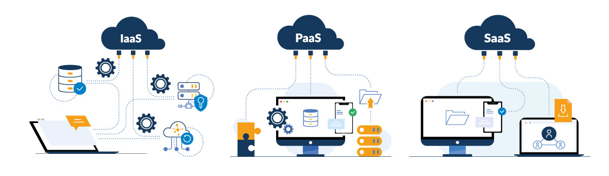

# **Amazon Web Services**

Issue: [#7](<https://github.com/Geosoft2/geosoft2-2021/issues/7>)  
Authors: [@JanSeemann92](https://github.com/JanSeemann92), [@fbruc03](https://github.com/fbruc03)

## _**Was ist AWS?**_

Amazon Web Services (AWS) ist ein Tochterunternehmen von Amazon, welches auf Cloud-Dienstleistungen spezialisiert ist. AWS stellt seinen Kunden unter anderem Rechenleistung, Speicheroptionen und Anwendungen zur Verfügung um diesen so den Aufbau anspruchsvoller Anwendungen zu erleichtern.
Amazon Web Services gilt heute als führender Anbieter im Bereich des Cloud-Computings.

---

## **Cloud Computing**

### _**Was ist Cloud Computing?**_

Als Cloud-Computing bezeichnet man die Nutzung von IT-Infrastrukturen und Dienstleistungen über ein Netzwerk (z.B. das Internet). Hierbei werden diese Daten oder Anwendungen nicht vor Ort auf dem lokalen Rechner gespeichert, sonder an einem beliebigen anderen Ort der oft mit einer Cloud illustriert wird.
Diese sogenannten Services sind On-Demand verfügbar und jederzeit skalierbar. Für Unternehmen entfallen somit große Vorabkosten für die Organisation der nötigen Infrastruktur.

---

### **Vorteile von Cloud-Compting**

- **Kapitalkosten werden durch variable Kosten ersetzt**
  - Kein eigenes Rechenzentrum oder Server nötig
- **Skalierbar**
  - Werden weniger Resourcen verbraucht fallen auch weniger Kosten an
- **Mehr Zeit für eigene Aufgaben**
  - Keine Zeit mit Bereitstellung und Wartung der eigenen Infrastruktur verschwenden
- **Ortsunabhängiger Zugriff**
  - Zugriff auf gewünschte Services ist nicht an den Arbeitsplatz gebunden

---

## **Cloud-Computing-Modelle**

### Infrastructure as a Service (IaaS) - Cloud Infrastruktur

Bereitstellung von Rechenzentrumsinfrastruktur z.B.:

- Server, Rechen- und Netzkapazitäten
- Kommunikationsgeräte (z.B. Router)
- Speicherplatz
- Systeme zur Archivierung und Sicherung von Daten

### Platform as a Service (PaaS) - Cloud Plattformen

Entwicklungsumgebung für die Entwicklung von neuen Anwendungen z.B.:

- Middleware
- Entwicklungstools
- BI-Dienste (Business Intelligence)
- Datenbankverwaltungssysteme

### Software as a Service (SaaS) - Cloud Anwendungen

Bereitstellung von Software z.B. in folgenden Bereichen:

- E-Mail
- Collaboration Tools
- Customer Relationship Management (CRM)
- Gehaltsabrechnung
- Verkaufs-, Personal- und Finanzmanagement
- Datenbanken
- Enterprise Resource Planning (ERP)
- Content Management
- Document Editing und Managment

---

## Processing (spatial) data

## Quellen

- <https://searchaws.techtarget.com/definition/Amazon-Web-Services>
- <https://aws.amazon.com/de/>
- <https://de.wikipedia.org/wiki/Platform_as_a_Service>
- <https://www.cloudcomputing-insider.de/was-ist-infrastructure-as-a-service-a-605071/>
- <https://www.computerwoche.de/a/was-ist-software-as-a-service,3332266>
- <https://www.sog.de/content/uploads/Cloud-Varianten-IaaS-PaaS-Saas.jpg>
