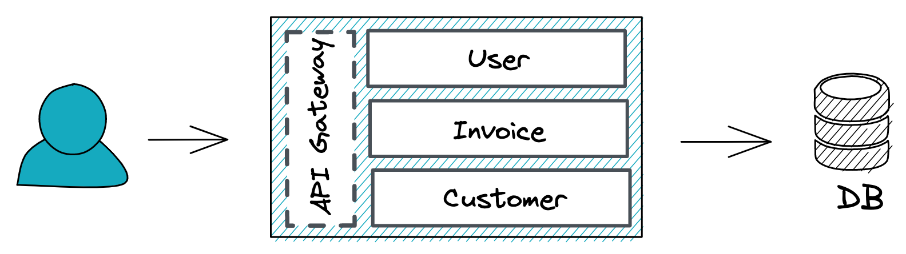

- Start Date: 2021-09-22
- Issue: [#10](https://github.com/Geosoft2/geosoft2-2021/issues/10)
- Authors: [@JudithBre](http://github.com/JudithBre/), [@nschnierer](http://github.com/nschnierer/)

## Summary

A microservice is a architectural pattern to structure web applications into smaller pieces or modules which are doing a specific job. These microservices communicate over a network to each other.

## Basic example

### API Gateway

Handles requests of the user and knows how to address the relevant microservice.

### Microservices

**User**

- `POST /login` -> Login with username and password
- `GET /me` -> Get the current user

**Invoice**

- `POST /invoices` -> Create a new invoice
- `GET /invoices` -> Get all invoices

**Customer**

- `POST /customers` -> Create a new customer
- `GET /customers` -> Get all customers

### Databases

Each microservice uses it's own database (DB) or an encapsulated application/instance on a database system.

## Motivation

- Scaling/planning of intensive processes
  - For example training a model or geoprocessing
  - Use resources efficiently
  - Scale on demand
- Distributed development
  - Developers are able to choose their language and technology
  - Independently teams which are working on different services
  - Easy to try out new ideas and roll back if something doesn't work
- Resilient
  - Independent services do not impact each other
  - Better testability of less complex services
- Easy Deployment
  - More modular and smaller than traditional applications

## Detailed design

There are various patterns for a microservice architecture to solve data management or the communication between services. Due this situation we've picked one framework from the NodeJS ecosystem which give us the flexibility to use several patterns or technologies.

NestJS is a framework which is written in TypeScript and brings up good design patterns for implementing software. NestJS natively supports the microservice architectural style of development because of its modular architecture. It's also possible to start with a monolith (see section "Alternatives") and afterwards to separate each module into a microservice.

"Nest supports several built-in transport layer implementations, called transporters, which are responsible for transmitting messages between different microservice instances. Most transporters natively support both request-response and event-based message styles." https://docs.nestjs.com/microservices/basics

## Drawbacks

- The communication between services can be quickly complex
- Lack of documentation can lead to problems when using other services
- Code reusability could drop significantly because independent teams may use different technologies
- Can significantly increase the overhead of deployment and management of multiple microservices

## Alternatives
A widely used architecture is the monolith structure. Mostly the fastest and easiest way to start with a web application. The business logic, data layer and the user interface is combined in one application.

Both options, the monolith or microsercive architecture could be combined with serverless. With this technique software code could be run without maintaining a server and could decrease the costs.

## Unresolved questions

- Is the microservice architecture a good fit for our project?
- What are the advantages of such an implementation?
- Is NestJS a good way to go? What about the integration of a microservice which are not using JavaScript/TypeScript?
- How to deploy and run microservices?

## Resources

- https://www.redhat.com/en/topics/microservices/what-are-microservices
- https://aws.amazon.com/microservices2
- https://docs.nestjs.com/microservices/basic3
- https://www.redhat.com/de/topics/cloud-native-apps/what-is-serverless4