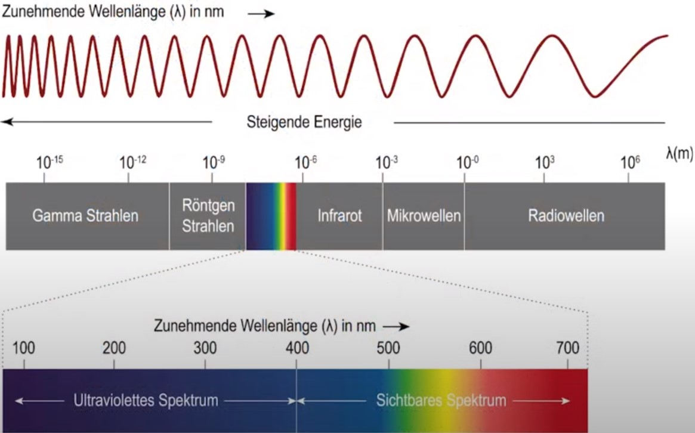

# Remote Sensing image analysis 

Handout von: [@jbalzer](https://github.com/jbalzer12), [@thalisgold](https://github.com/thalisgold)

## Was ist Fernerkundung?

* Kontaktfreies Erfassen von Informationen über eine Fläche
* Z.B. mit Sensoren, die an Satelliten, Flugzeugen oder Drohnen angebracht sind
* Das elektromagnetische Spektrum spielt in der Fernerkundung die zentrale Rolle
* Sensor zeichnet elektromagnetische Strahlung auf, die an der Erdoberfläche und ihren Objekten reflektiert wird

* Sie nutzt aus, dass jedes Material auf der Erde die elektromagnetische Strahlung anders reflektiert
* Daraus lassen sich letztlich Rückschlüsse auf Positionsinformationen von Objekten und Hinweise auf Eigenschaften von Oberflächen ziehen
* Wenn diese Rückschlüsse objektspezifisch und signifikant sind, können sie zur Objektklassifikation herangezogen werden!
* Wichtig: In der Fernerkundung sind auch Bereiche des EMS interessant, die das menschliche Auge nicht erfassen kann
* Bekanntes Beispiel: Vegetation reflektiert in nahem Infrarot besonders stark 
* (vgl. [KONSAB](https://www.youtube.com/watch?v=U9fF3KsQOMc&ab_channel=FernerkundungLernen))

## Vorteile Fernerkundung mit Satelliten

  * Großflächige Abdeckung
  * Häufige und sich wiederholende Abdeckung eines Interessenbereichs
  * Relativ niedrigere Kosten pro Einheitsgebiet der Abdeckung
  * Viele frei verfügbare Daten
  * Computergestützte Verarbeitung und Analyse
  * (vgl. [CRISP](https://crisp.nus.edu.sg/~research/tutorial/spacebrn.htm))

## Arten der Fernerkundung 

Man unterscheidet anhand des EMS drei große Bereiche:

* Optische Fernerkundung:
  * Meist passiv (empfangen Signale)
  * Umfasst den sichtbaren, den nahen und fernen Infrarotbereich
  *	Anfällig gegenüber Wolken/Aerosole
  *	Fernerkundungssysteme können abhängig von der Anzahl, der von ihnen verwendeten spektralen Kanäle in folgende Typen unterteilt werden:
    * Panchromatisch: Nur ein Kanal, der für Strahlung in einem breiten Wellenlängenbereich empfindlich ist.
    * Multispektral: 7-12 Kanäle. Jeder Kanal ist empfindlich gegenüber Strahlung innerhalb eines schmalen Wellenlängenbereichs. Das resultierende Bild ist ein mehrschichtiges Bild, das sowohl die Helligkeits- als auch die spektralen (Farb-) Informationen der beobachteten Objekte enthält
    * Hyperspektral: Hundert oder mehr zusammenhängende Spektralkanäle
    * (vgl. [Lingli Zhu et al.](https://www.intechopen.com/chapters/57384))
*	Radar Fernerkundung:
    *	Meist aktiv (senden Strahlung selbst aus und empfangen Signale als Energiepulse, die je nach Oberfläche unterschiedlich stark ausfallen)
    *	Aufnahmen unabhängig von Bewölkung und Tageszeit
    *	(vgl. [KONSAB](https://www.youtube.com/watch?v=U9fF3KsQOMc&ab_channel=FernerkundungLernen))
*	Thermale Fernerkundung:
    *	Misst Temperatur der Erdoberfläche
    *	Bisher nur geringe räumliche Auflösung
    *	(vgl. [KONSAB](https://www.youtube.com/watch?v=U9fF3KsQOMc&ab_channel=FernerkundungLernen))

## Vier Auflösungsdimensionen:
  * Zeitliche Auflösung (Variationen, z.B. Herbst/Frühling)
  * Räumliche Auflösung (Variationen, z.B. m/Pixel, d.h. Größenveränderung)
  * Radiometrische Auflösung (Anzahl der Informationen in bit, z.B. 8 bit, 16 bit etc.)
  *	Spektrale Auflösung (Wellenlängen, z.B. VIS und IR)
  *	(vgl. [Torsten Prinz](https://ivvgeo.uni-muenster.de/vorlesung/FE_Script/1_2.html))
  
  * Bsp. für Satellit: Sentinel-2
    * 13 Kanäle/Bänder
    * Überfliegung alle 5 bis 7 Tage
    *	Auflösung 10/20/60m
    *	(vgl. [KONSAB](https://www.youtube.com/watch?v=U9fF3KsQOMc&ab_channel=FernerkundungLernen))

## Auswahl aktuell verbreiteter Satellitenprogramme: 

* Landsat 8:
  * Start: 2013
  * Wiederholrate: 16 Tage
  * Auflösung: 15 m panchromatisch / VIS - SWIR 30 m
  * Liefert Aufnahmen im sichtbaren und infraroten Spektrum
  
[https://www.d-copernicus.de/](https://www.d-copernicus.de/daten/satelliten/satelliten-details/news/landsat-8/?tx_news_pi1%5Bcontroller%5D=News&tx_news_pi1%5Baction%5D=detail&cHash=c74ab3f39ecbc62a0a85cf3ee7b297fd) 

* Sentinel 1-3:
  * Teil des Copernicus-Programm der ESA
  * Sentinel 1:
    * Radar, 
    * Auflösung: 5 m
    * Start: 2014 (1A), 2016 (1B)
  * Sentinel 2:
    * passiv-optische Erdbeobachtung für Vegetation
    * Auflösung: 10 m
    * Start: 2015 (2A), 2017 (2B)
  * Sentinel 3:
    * Optisch/Thermisch für die Meere
    * Start: 2016 (3A), 2018 (3B)
  
[https://www.d-copernicus.de/](https://www.d-copernicus.de/daten/satelliten/daten-sentinels/)

## Datenformate

* Grafische Fernerkundungsdaten werden in der Regel als Rasterdaten gespeichert und enthalten “Bänder”, falls mehrere Farbkanäle existieren (vgl. [Nagesh Kumar](https://nptel.ac.in/courses/105/108/105108077/))
* Mögliche Datentypen beim Download von Daten:

| Satellit | Mögliche Formate |
|:------------------ |:-------------------|
| Landsat             | .txt, .xml, .tif (GeoTIFF), (.jpeg)             |
| Sentinel 1 - Level 1            | .tif             |
| Sentinel 1 - Level 2            | .nc (NetCDF)             |
| Sentinel 2            | .jp2 (JPEG2000), .tif (GeoTIFF)             |
| Sentinel 3        | .nc (NetCDF)             |

* Downloadportale, an denen ich mich orientiert habe: 
  * [https://earthexplorer.usgs.gov](https://earthexplorer.usgs.gov) (Landsat, Sentinel 2)
  * [https://scihub.copernicus.eu/dhus/#/home](https://scihub.copernicus.eu/dhus/#/home) (Sentinel 1, Sentinel 2, Sentinel 3)

* Bsp. für einen cloudbasierten Downloaddienst: [https://browser.creodias.eu](https://browser.creodias.eu)
* Archiv des Landsat-Programms und erleichterte Auswahl der AOI über: [https://landsatlook.usgs.gov/explore](https://landsatlook.usgs.gov/explore)

## Übersicht der verwendeten Dateiformate: 

| Dateiformat | Beschreibung |
|:---------|:------------------------|
| **.txt** | -  Textdatei mit Pixelwerten (vgl. [https://docs.fileformat.com/word-processing/txt/](https://docs.fileformat.com/word-processing/txt/))  - Bilddateien sehr groß (vgl. [https://earthexplorer.usgs.gov](https://earthexplorer.usgs.gov))   |
| **.xml** | - Standardisiertes Format zum Speichern und Transportieren von Daten    (vgl. [https://www.w3schools.com/xml/xml_whatis.asp](https://www.w3schools.com/xml/xml_whatis.asp))|
|**JPEG**  (.jpg)| -  Komprimierte Grafikdatei   - Bei starker Kompression um Faktor >= 30 weist JPEG Schwächen auf   - ISO/IEC 109818-1   (vgl. [https://www.heise.de/](https://www.heise.de/ix/artikel/Bilder-schrumpfen-505974.html))|
|**JPEG2000** (.jp2)| - Komprimierte Grafikdatei   - ISO/IEC Standard 15444-1   - Höhere Kompressionsrate als JPEG   - Übergroße Bilder mit mehr als 64kx64k Pixel möglich  - Wavelet-Verfahren (bei Verkleinerung um Faktor 40)   (vgl. [https://www.heise.de/](https://www.heise.de/ix/artikel/Bilder-schrumpfen-505974.html))|
|**GeoTIFF** (.tif, .tiff)| - Gängigstes Format zur Speicherung von Rastergrafiken mit Bildkompression   - Ermöglicht sowohl verlustbehaftete als auch verlustlose Kompression   - Basiert auf der diskreten Wavelet-Transformation   - Enthält zusätzliche eine Georeferenzierung der Rasterdaten   - Weltweit weit verbreitet   * Open Source Packages (bspw. GDAL in R) sowie Softwaresupport gut zugänglich <  - Wird von den meisten GIS gelesen   - Nicht geeignet für Vektordaten und komplexe multidimensionale Daten   (vgl. [https://earthdata.nasa.gov/](https://earthdata.nasa.gov/esdis/eso/standards-and-references/geotiff))|
| **NetCDF** (.nc) |  - Dateiformat zum Speichern mehrdimensionaler wissenschaftlicher Daten - Falls die Datei in einer anderen Reihenfolge gelesen werden soll, als sie geschrieben ist, ist NetCDF die effizienteste Methode  (vgl. [https://pro.arcgis.com/de/](https://pro.arcgis.com/de/pro-app/2.7/help/data/multidimensional/what-is-netcdf-data.htm), [https://www.unidata.ucar.edu/](https://www.unidata.ucar.edu/software/netcdf/workshops/2011/performance/Time.html))

## Analyse von Fernerkundungsdaten in R: 

* Hilfreiche Packages: 

| Package | Beschreibung |
|:----------|:----------|
| sp    | - zentral für die Analyse räumlicher Daten   - Definiert Klassen zur Repräsentation räumlicher Daten  [https://cran.r-project.org/web/packages/sp/sp.pdf](https://cran.r-project.org/web/packages/sp/sp.pdf)|
| rgdal | - Ermöglicht den Zugang zu Operationen der PROJ-Bibliothek zur Transformation und Projektion   [https://cran.r-project.org/web/packages/rgdal/rgdal.pdf](https://cran.r-project.org/web/packages/rgdal/rgdal.pdf)|
| raster | - Enthält Klassen und Funktionen zur Manipulation und dem Umgang mit räumlichen Daten im Raster-Format   [https://cran.r-project.org/web/packages/raster/raster.pdf](https://cran.r-project.org/web/packages/raster/raster.pdf)|
| ggplot2 | - Package zum Erstellen von Datenvisualisierungen   [https://cran.r-project.org/web/packages/ggplot2/index.html](https://cran.r-project.org/web/packages/ggplot2/index.html)|
| viridis | - Package zum Kolorieren von Grafiken   [https://cran.r-project.org/web/packages/viridis/viridis.pdf](https://cran.r-project.org/web/packages/viridis/viridis.pdf)|
| rasterVis | - Enthält Methoden zur Visualisierung und Interaktion mit Rasterdaten   [https://cran.r-project.org/web/packages/rasterVis/index.html](https://cran.r-project.org/web/packages/rasterVis/index.html)|

* Tutorials zur Analyse von Fernerkundungsdaten in R: 
  * [https://rspatial.org/rs/rs.pdf](https://rspatial.org/rs/rs.pdf)
  * [https://cran.r-project.org/web/packages/rasterVis/index.html](https://cran.r-project.org/web/packages/rasterVis/index.html)
  * [https://ourcodingclub.github.io/tutorials/spatial/](https://ourcodingclub.github.io/tutorials/spatial/)
  * [https://pad.uni-muenster.de/s/XWCQrtgj2#](https://pad.uni-muenster.de/s/XWCQrtgj2#)
